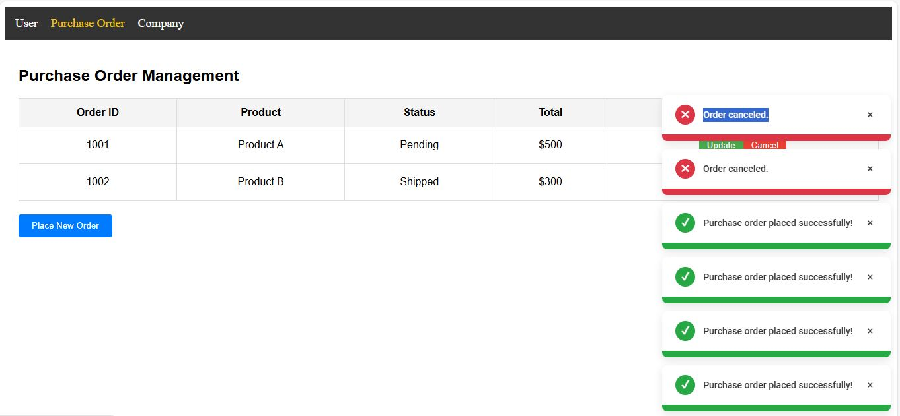

There are 3 folders inside notification-system.

container --> main root app
about 	  --> micro frontend 1
contact   --> micro frontend 2

Steps to run the  project. 

1- Clone the repo

2- run npm i by navigating into each directory.

3- run npm start to run each service

4- open localhost:9000 to see the project running

The other two microfrontend about and contact are served on localhost 8080 and 8081 respectively.

## Screenshots

### Screenshot 1: Main Interface

### Screenshot 2: Purchase Order

### Screenshot 3: Company Detail

